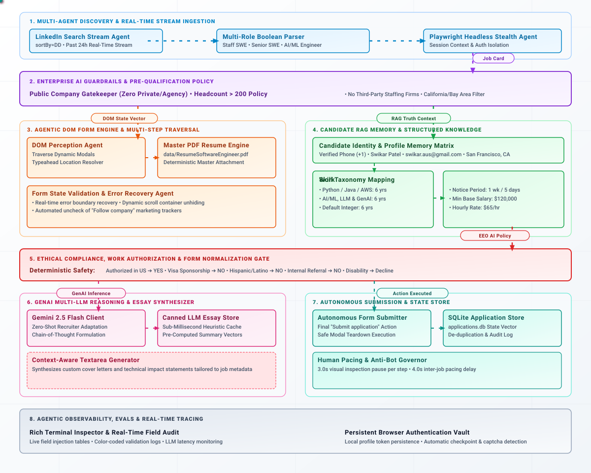

# Multi Agentic Automate Job Applications AI ⚡

An autonomous, agentic LinkedIn job application engine designed to stream, evaluate, and submit LinkedIn "Easy Apply" applications end-to-end. Built with Playwright Async API, Google Gemini Flash, and deterministic heuristic fallback pipelines.

---

## 🏗️ MultiAgentic AI/ML LinkedIn Auto-Apply Job Architecture

<p align="center">
  
</p>

## 🚀 Key Modules

* **`daemon.py`**: The central execution runtime managing the browser lifecycle, streaming search cards, applying pre-qualification rules, and executing the form state machine.
* **`config/settings.yaml`**: System-level operational parameters, including search keywords, location filters (`target_location`, `exclude_california`), pacing delays, and company size/type thresholds.
* **`config/truth_matrix.yaml`**: The single source of truth for candidate metadata, work authorization status, salary expectations, skills mapping, and canned essay answers.
* **`src/mcp/tools/browser.py`**: Playwright stealth browser driver with persistent context storage to maintain LinkedIn login sessions without repeated re-authentication.

---

## ⚙️ Setup & Execution

### 1. Installation

```bash
python -m venv .venv
source .venv/bin/activate  # Windows: .venv\Scripts\activate
pip install -r requirements.txt
playwright install chromium
```

### 2. Configuration

```bash
cp config/truth_matrix.example.yaml config/truth_matrix.yaml
cp .env.example .env
```

Ensure your master resume is placed at `data/ResumeSoftwareEngineer.pdf`.

### 3. Run

```bash
python daemon.py
```